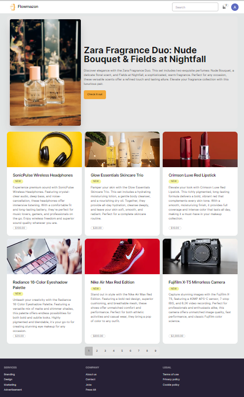
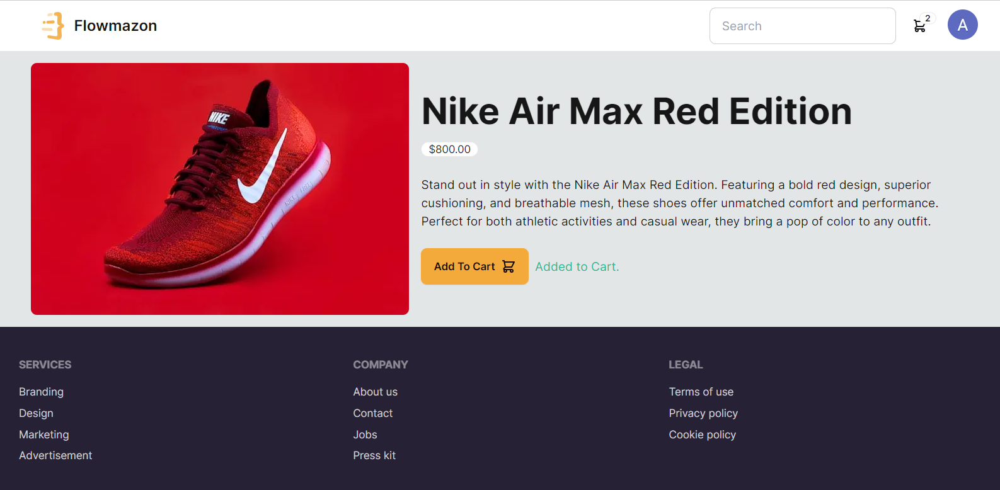
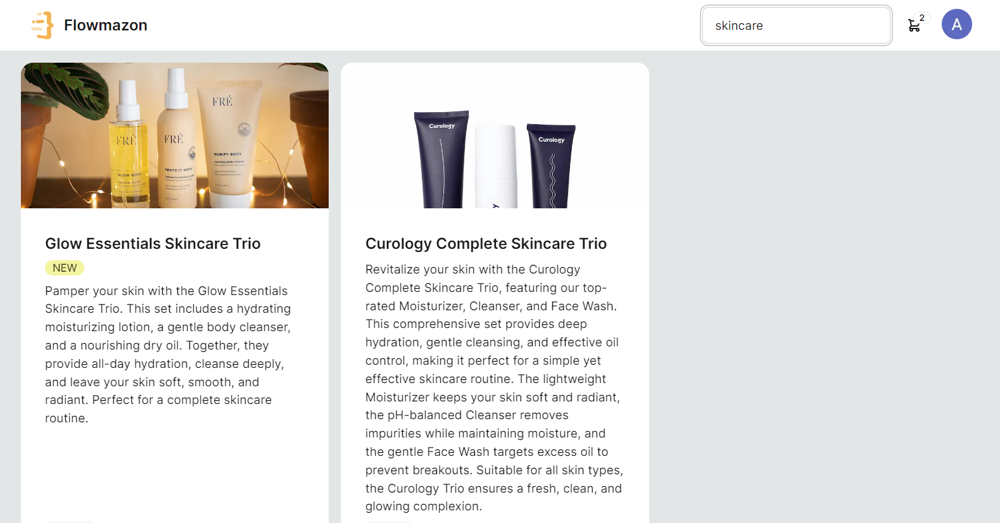
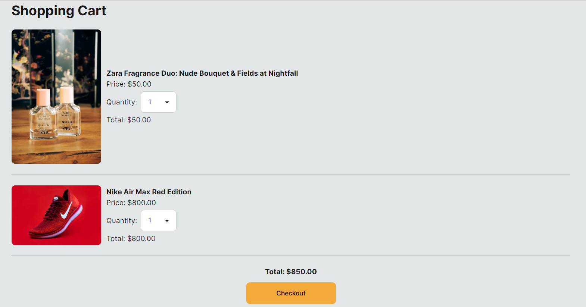
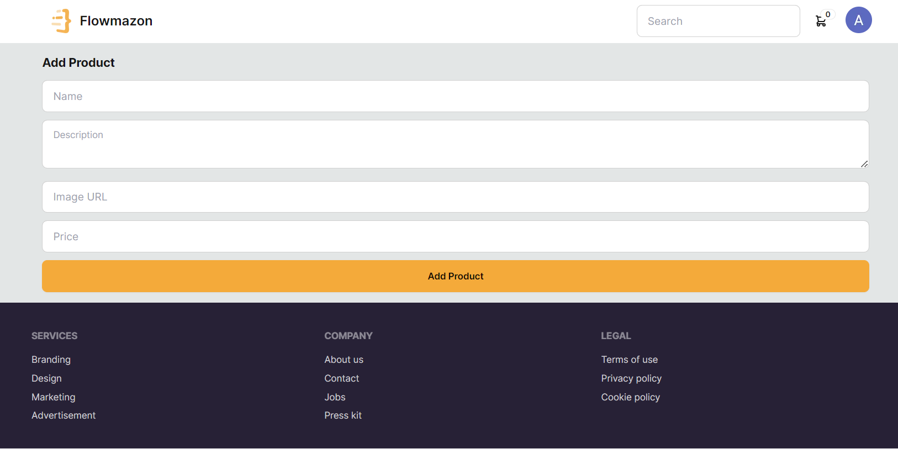

# **E-Commerce Platform**

## **Project Overview**

This project is a full-featured e-commerce web application designed to provide secure user authentication and personalized shopping experiences. Developed with a focus on performance and scalability, the platform allows users to manage their shopping cart in real-time, even across sessions, and provides an admin interface for streamlined product management.

## **Key Features**

- **User Authentication:** Secure user login and registration using NextAuth with persistent sessions across logins.
- **Dynamic Cart Updates:** Real-time updates to the shopping cart, ensuring a seamless user experience.
- **Product Management:** An intuitive admin interface built with Next.js and Prisma for easy product additions and management.
- **Persistent Data:** Shopping cart data remains intact across sessions, ensuring that users find their items in the cart even after logging out and logging back in.

## **Technology Stack**

- **Next.js:** A React framework for building server-rendered web applications.
- **MongoDB:** A NoSQL database used for storing user data, products, and cart information.
- **Prisma:** An ORM for managing database interactions, ensuring efficient and type-safe access to data.
- **NextAuth:** A library for handling user authentication in Next.js applications.

## **Deployment**

This application is deployed on Vercel, offering seamless deployment with Next.js optimizations.

**[Live Demo](https://next-js-ecommerce-r59rrcrit-asthapanda02-gmailcoms-projects.vercel.app/)**

## **Screenshots**
### **Home Page**
The homepage displays all products and a featured product, offering an overview of available items.

### **Products Page**
This page shows detailed information about a single product along with an "added to cart" message when the item is added to the shopping cart.

### **Search Results Page**
The search results page demonstrates the functionality of the search bar. For instance, searching for "camera" will show all products related to the search term.

### **Cart Page**
The cart page displays all products added to the cart along with the total price, allowing users to review and manage their selected items.

### **Add Products Page**
This admin interface allows adding new products to the website and database, streamlining product management.

## **Demo Video**

Check out the application in action with our [Demo Video](https://drive.google.com/file/d/1veJWw6VjBY9AguUATmOwFLcQ2nWWKuvh/view?usp=sharing).

## **Use Cases**

1. **Personalized Shopping Experience:** Users enjoy a customized experience with persistent cart data and secure authentication.
2. **Efficient Product Management:** Admins can easily add and manage products, optimizing operations.
3. **Real-Time Updates:** The dynamic cart updates in real-time, ensuring a smooth shopping experience.
